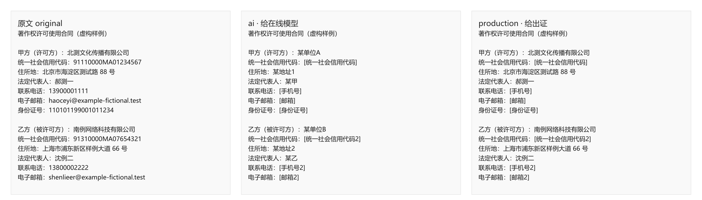

[简体中文](README.md) | [English](README.en.md)

# legal-redactor

[](https://github.com/qwertyzhu/legal-redactor/actions/workflows/ci.yml)
[](LICENSE)
[](pyproject.toml)

**中国法律文书本地脱敏：给 AI 之前去标识，交法院 / 对方之前只去掉证件号、手机、邮箱。**  
**Local-first dual-mode redaction for Chinese legal documents.**  
Same format out as in: DOCX→DOCX, PDF→PDF (text-layer), text→text.  
Built for lawyers who need (1) a privacy-safe copy before pasting into online AI, and (2) a selective production copy before court or opponent disclosure.

> Early preview. Does not replace lawyer judgment. A passing residual scan is not proof of perfect anonymization.

## Two modes

| Mode | Destination | Default behavior |
|---|---|---|
| `ai` | Online models, shareable notes, public fixtures | Aggressive: names, orgs, case numbers, IDs, phones, emails, accounts, USCC + agent-listed entities |
| `production` | Court / opposing party | Keep parties & case numbers; strip IDs, phones, emails, bank accounts, USCC; optional third-party entities |

Agent (or you) supplies person/org/work-title entities. The CLI applies replacements deterministically and residual-scans structural PII.

### Hide Party A, Party B, or both

For scanned contracts, the user can choose to hide Party A only, Party B only, or both parties. Whole-party mode covers confirmed names, contacts, addresses, contact details, and accounts, plus reviewed regions for signatures and the **complete seal**. An unselected party is preserved by default.

```console
legal-redactor redact-scan scan.pdf --mode production \
  --redact-party a --party-spec party-spec.json \
  -o scan.party-a-redacted.pdf
```

Start from `skills/legal-document-redactor/references/party-redaction.template.json`. A seal must be covered by a reviewed normalized region containing its full outer ring, entity name, number, and center mark; OCR text boxes alone are insufficient. Review every output page before delivery.

## 60-second start

```console
git clone https://github.com/qwertyzhu/legal-redactor.git
cd legal-redactor
python -m pip install -e ".[dev]"
legal-redactor --version
python scripts/run_demo.py --clean
```

`run_demo.py` redacts the in-repo fictional contract in **both** modes and writes same-format `md` / `docx` / `pdf` under `demo-output/`. It must print that every residual scan passed. Re-run with `--clean` any time; the result is deterministic.

## Fictional before / after

The sample party is **郝测一** and the sample mobile is **13900001111** (fully fictional).

| Field | Original | `ai` | `production` |
|---|---|---|---|
| Party name | 郝测一 | removed (alias `某甲`) | **kept** |
| Mobile | 13900001111 | removed | removed |
| Case number | （2024）京0491民初1234号 | removed | **kept** |



```text
# original (excerpt)
法定代表人：郝测一
联系电话：13900001111
关联案号示例：（2024）京0491民初1234号

# after --mode ai
法定代表人：某甲
联系电话：[手机号]
关联案号示例：（20XX）XX民初XX号

# after --mode production
法定代表人：郝测一
联系电话：[手机号]
关联案号示例：（2024）京0491民初1234号
```

Never use `ai` output as a court filing. Never upload `*.ledger.json`.

## Install

From a clone (documented path; PyPI is not published yet):

```console
python -m pip install -e ".[dev]"
legal-redactor --help    # lists redact / scan / verify
```

CLI-only from the GitHub Release wheel:

```console
python -m pip install https://github.com/qwertyzhu/legal-redactor/releases/download/v0.9.0/legal_redactor-0.9.0-py3-none-any.whl
```

Or install from the latest [GitHub Release](https://github.com/qwertyzhu/legal-redactor/releases/latest).

### Claude Code / Codex skill

Copy or junction `skills/legal-document-redactor` into `~/.claude/skills/` (or `~/.agents/skills/`).  
Release assets also include a packed `legal-document-redactor.skill` plus `SHA256SUMS.txt`.

Codex:

```text
$skill-installer
Install skill from qwertyzhu/legal-redactor:
- skills/legal-document-redactor
```

## CLI

```console
# Scan only
legal-redactor scan contract.docx --mode ai

# Redact for online AI (entities JSON optional but recommended for names)
legal-redactor redact contract.docx --mode ai --entities entities.json -o contract.redacted-ai.docx

# Redact for court/opponent production
legal-redactor redact contract.docx --mode production --entities entities.json -o contract.redacted-production.docx

# Keep USCC on a filing that requires it
legal-redactor redact contract.docx --mode production --keep-categories uscc -o out.docx
legal-redactor verify out.docx --mode production --keep-categories uscc

# Scanned PDF (no text layer)
legal-redactor ocr scan.pdf -o workdir/
legal-redactor redact workdir/ocr.normalized.md --mode production -o workdir/out.md
legal-redactor redact-scan scan.pdf --mode production -o scan.redacted-production.pdf

# Residual check
legal-redactor verify contract.redacted-ai.docx --mode ai

# Draft entities skeleton (structural + NL suspect hints)
legal-redactor draft-entities contract.docx -o entities.draft.json

# Batch a folder of documents (two-pass: unify aliases then redact)
legal-redactor redact ./matters/ --mode ai --unify -o ./matters-redacted/

# Or unify manually, then reuse the file
legal-redactor unify ./matters/ -o ./matter-unified/ --mode ai
legal-redactor redact ./matters/ --mode ai --entities ./matter-unified/entities.consistent.json -o ./matters-redacted/

# Directory scan / residual verify
legal-redactor scan ./matters/ --mode ai
legal-redactor verify ./matters-redacted/ --mode ai
```

Each successful `redact` also writes:

- `*.ledger.json` — original→replacement map (**keep local; never commit or upload**)
- `*.residual.json` — structural residual report
- `*.suspects.json` — natural-language entity **hints** (not auto-redacted)
- `*.summary.md` — human-readable table

Batch also writes `entities.consistent.json` + `consistency.report.*` under the work dir.

Scanned workflow: `skills/legal-document-redactor/references/scanned-pdf.md`.  
Entity starter: `skills/legal-document-redactor/references/entities.template.json`.  
Optional structural + suspect draft: `legal-redactor draft-entities INPUT.docx`.

## Tests

```console
python -m pytest
python scripts/run_demo.py --clean
```

Demo inputs are completely fictional. Any resemblance to real parties is coincidental.

## Architecture

```text
Document → extract text → merge structural detectors + entities.json
        → longest-first replace → write same format
        → residual structural scan → human review
```

Details: [skills/legal-document-redactor/references/methodology.md](skills/legal-document-redactor/references/methodology.md)

## Limits (v0.8)

- PDF: text-layer via `redact`; scans via `ocr` / `redact-scan` (local Tesseract + chi_sim)
- `redact-scan` is OCR-box best-effort — **human page-flip before court filing**
- Natural-language names need confirmed `entities.json`; suspects are hints only
- Multi-doc AI upload: prefer `redact DIR --unify` so aliases stay stable
- DOCX: single-run formatting is preserved when possible; cross-run entities still collapse the paragraph
- Batch redact is flat output names (recursive mode disambiguates colliding basenames)
- Directory `verify` will scan all supported suffixes present (including `.json` sidecars if mixed in)
- Not legal advice; not a substitute for firm confidentiality procedure

## Security

Do not open issues with real client files, ledgers, or live matter identifiers. See [SECURITY.md](SECURITY.md).

## License

Apache License 2.0. See [LICENSE](LICENSE) and [NOTICE](NOTICE).
